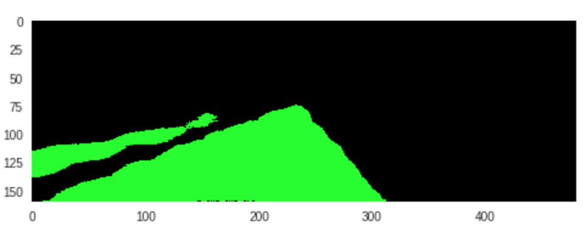

# FCN Comparison
## Evaluating the benefit of skip connections in semantic segmentation networks.

### Summary:
In the paper [Fully Convolutional Networks for Semantic Segmentation](https://people.eecs.berkeley.edu/~jonlong/long_shelhamer_fcn.pdf), the authors described how fully convolutional networks can be utiziled to make pixel-wise predictions for semantic segmentation tasks. The paper mentions three FCN architectures, FCN32s, FCN16s and FCN8s, which are all built on top of a VGG16 model with transpose convolutions used to upsample the layers back to the original image height and width. 
### Model Architectures:
The architecture of the VGG16 network can be viewed [here](https://github.com/keras-team/keras/blob/master/keras/applications/vgg16.py), and in the fully convolutional version the 2 fully connected layers ('fc1' and 'fc2') are converted to convolutional layers. The semantic segmentation networks that I have implemented in this project are built on top of the fully convolutional VGG16 network.

To build the FCN32s network, a 1x1 convolution is applied to the output of the second convolutionalized, fully connected layer of the VGG16, and then a transpose convolution with strides of 32x32 upsamples the output to the original input image height and width. 

In the FCN16s, the output from the second fully connected layer is upsampled using a transpose convolution with stride = 2, and a skip connection is applied which combines the output of the upsampled layer with the block 4 pooling layer. After applying the skip connection, the output of the model will is another transpose convolution, this time with strides of 16x16.

The FCN8s follows the same architecture as the FCN16s, except an additional skip connection is applied which also incorporates the output from the block 3 pooling layer. The output of this model is a transpose convolution with strides of 8x8. 

I have implemented all 3 of these model architectures built on top of a VGG16 network with pretrained weights (trained on the imagenet dataset). My implementations of the models can be seen in the respective ipython notebooks:
* [FCN32.ipynb](FCN32.ipynb)
* [FCN16.ipynb](FCN16.ipynb)
* [FCN8.ipynb](FCN8.ipynb)

### Model Outputs:
The authors of the paper emphasized the importance of combining layers with different strides to improve the segmentation detail, and their example output images showed that the models with skip connections made predictions which were much closer to the ground truth image.

I wanted to implement all 3 models, train them all on the same dataset, and visualize the predictions from each model to see the difference for myself. For this project I have used the [Kitti Road Dataset](http://www.cvlibs.net/datasets/kitti/eval_road.php) which contains several hundred images of road scenes with ground truth masks. 

I trained each model for 25 epochs using an Adam optimizer and learning rate of 0.001. I implemented a [Model Checkpoint](https://keras.io/callbacks/#modelcheckpoint) to save the weights from the epoch with the lowest validation loss. In this project I am not too much interested in any particular metric from training the models, I am really focusing on visualizing the predictions from the models to see the benefit from adding skip connections to the network.

Example outputs of each model can be seen below.

##### Test Image:

##### FCN32 output mask:

##### FCN32 road overlay:

It is clear that the model has generally identified the location of the road, but the borders of the road are not very well defined. This model was also not able to identify much of the other lane on the left side of the image.

##### FCN16 output mask:

##### FCN16 road overlay:

This is a clear improvement over the fcn32 output, the boudnaries of the road are very clearly defined.

##### FCN8 output mask:

##### FCN8 road overlay:

This generally looks like a slight improvement over the fcn16 output, expecially in identifying the other lane on the left side of the image. The only downside here is that there are a couple of random false positive detections on the right side of the image but they could probably be ignored based on their size and location.

In conclusion it is clear that all three models are able to generally identify the location of the road in the image, but the models with skip connections (FCN16s and FCN8s) have much more accurately defined the boundaries of the road. 

### Code:
This project requires python 3 and the following dependencies:
* [Keras](https://keras.io/)
* [Tensorflow](https://www.tensorflow.org/)
* [Numpy](http://www.numpy.org/)
* [Scipy](https://www.scipy.org/)
* [OpenCV](https://opencv.org/)

To run the code, first download the datasaet from [here](http://www.cvlibs.net/download.php?file=data_road.zip) and then launch one of the notebooks from a terminal, for example:
```
jupyter notebook FCN8.ipynb
```
